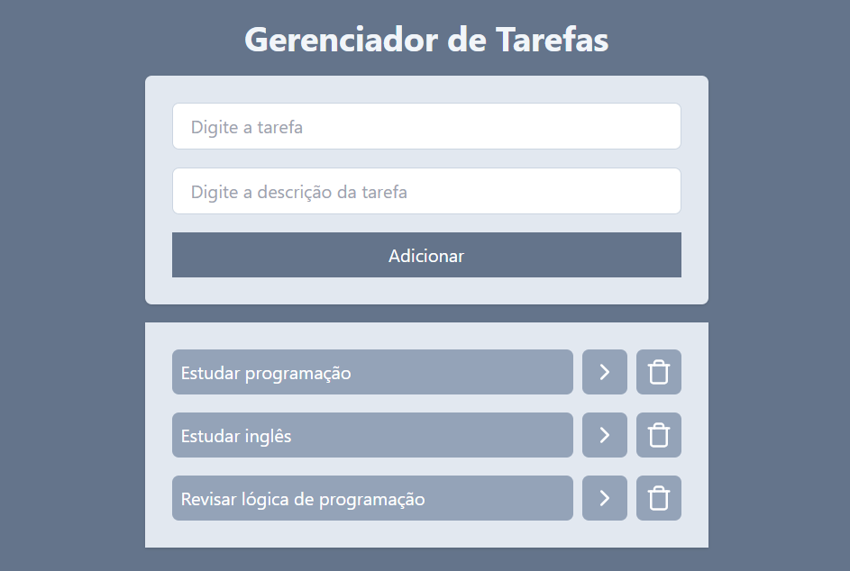

# 📝 Gerenciador de Tarefas

Um simples gerenciador de tarefas desenvolvido com **Vite+React** e estilizado com **Tailwind CSS**. A aplicação permite adicionar, visualizar, detalhar e excluir tarefas de forma intuitiva.

## 📸 Prévia

 <!-- Substitua com o caminho real da imagem se necessário -->

## 🚀 Funcionalidades

- ✅ Adicionar uma nova tarefa com título e descrição.
- 📋 Listar todas as tarefas adicionadas.
- 🔍 Visualizar detalhes de cada tarefa.
- 🗑️ Remover tarefas da lista.

## 🛠️ Tecnologias Utilizadas

- [React](https://react.dev/)
- [Vite](https://vitejs.dev/)
- [Tailwind CSS](https://tailwindcss.com/)
- [JavaScript](https://developer.mozilla.org/pt-BR/docs/Web/JavaScript)
- [HTML5](https://developer.mozilla.org/pt-BR/docs/Web/HTML)

## 📁 Estrutura de Pastas

gerenciador-tarefas/ ├── node_modules/ ├── public/ ├── src/ │ └── (componentes e lógica da aplicação) ├── index.html ├── package.json ├── tailwind.config.js ├── vite.config.js └── README.md

## ▶️ Como Rodar o Projeto

1. **Clone o repositório:**

```bash
git clone https://github.com/seu-usuario/gerenciador-tarefas.git

-npm install
-npm run dev
```
